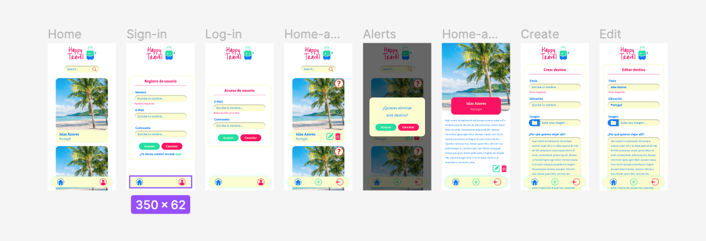

# Happy Travel

   

## Developers
 [ Génesis Núñez](https://github.com/genesis-nf)| [ Florencia Bordón](https://github.com/florienborg) |  [ Cindy Leiva](https://github.com/CindyLeiva) |  [ Mónica Blanco](https://github.com/mgblanco10) |  
| :---: | :---: | :---: | :---: |

## 📓 Tabla de contenidos 
   1. [Información General](#información-general)
   2. [Mockups](#mockups)
   3. [Tecnologías](#tecnologías)
   4. [Herramientas](#herramientas)
   5. [Recursos](#recursos)

## 🗃 Información General
Hablando de Vacaciones, ¿A quién no le gusta viajar y conocer lugares nuevos? La empresa HappyTravel nos ha contratado para desarrollar una aplicación web, para que las personas puedan contar los destinos que les encantaría visitar y su razón. El objetivo es que usuarios no autenticados puedan mirar todos los destinos soñados de otros usuarios y a su vez un usuario autenticado pueda crear, editar y eliminar su propios sueños viajeros.

## Mockups

#### Atomic Design

#### Versión Desktop

#### Versión Mobile

## 🛠 Tecnologías

  

## 🛠 Herramientas

 

## Instalación

Breve descripción de como poder ver nuestro proyecto, para ejecutarlo necesitas tener conocimientos previos sobre como funciona Mamp/Xamp y tener instalado composer
1. Clona este repositorio en tu máquina local:
`https://github.com/florienborg/happytravel.git`
2. Coloca la carpeta del proyecto en la carpeta de proyectos de tu MAMP o XAMPP según sea el caso.
3. Crea la base de datos y la tabla:
- Abre tu gestor de bases de datos (por ejemplo, phpMyAdmin).
- Crea una nueva base de datos con el nombre  "happy_travel" aquí las tablas las realizaremos desde tú editor de código.
4. Abre en tú editor de texto el proyecto y luego dentro de la carpeta laravel en la terminal debes poner
`composer install`
y luego, el cuál hará que se carguen las tablas del proyecto
`php artisan migrate`
Esta es una aplicación para guardar y compartir destinos, entoncés para que tener algunos datos en la base de datos, hemos creado los seeders los cuales te permitirán tener 10 destininos estos no podrás borrarlos, ni editarlos a diferencia de los que cargues tú, para poder tener estos destinos debes en la terminal poner 
`php artisan db:seed --class=DestinationsTableSeeder`

y finalmente para ver el proyecto en tú navegador ejecuta el comando 

`php artisan server`

Y disfruta de la experiencia de ver y guardar destinos.

## Recursos
- [login y register](https://www.positronx.io/laravel-custom-authentication-login-and-registration-tutorial/)

- [CRUD](https://www.youtube.com/watch?v=Rxz0GwUassM)

- [CRUD Laravel 10](https://www.youtube.com/watch?v=MJp8ycjNW5s)
